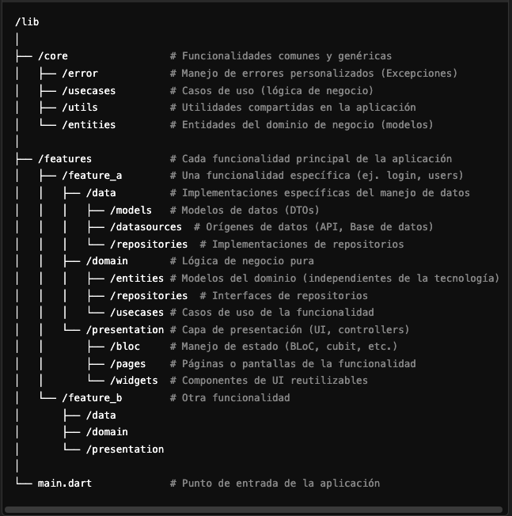
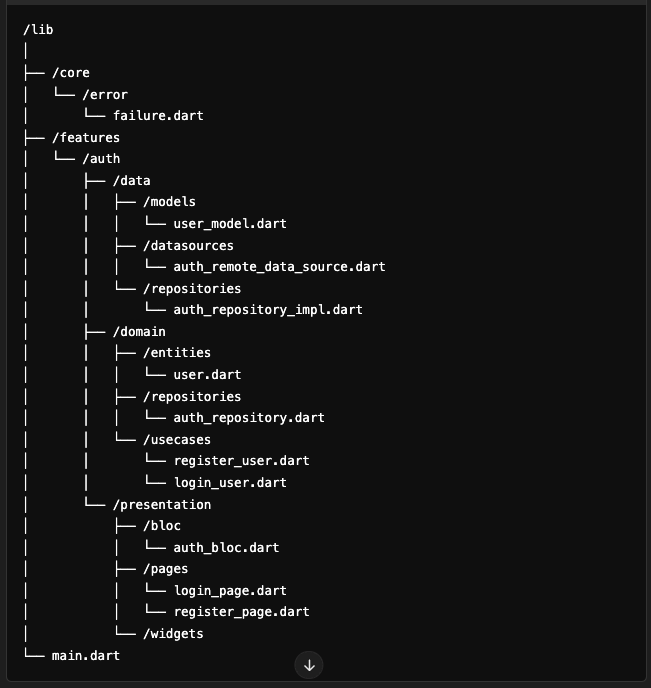

# ShopCart

**ShopCart** is a Flutter application for managing a shopping cart, developed using clean architecture principles.

## Getting Started

Follow these steps to get the project up and running:

1. **Clone the repository**

   ```bash
   git clone https://github.com/adrianferreiro/shop_cart.git
   ```

2. **Navigate to the project directory**

   ```bash
   cd shop_cart
   ```

3. **Install dependencies**

   ```bash
   flutter pub get
   ```

4. **Run the project**

   ```bash
   flutter run
   ```

5. **Build for production**

   ```bash
   flutter build aab # For Android
   flutter build ios # For iOS
   ```

# Prerequisites

Flutter SDK >= 3.0.0

Dart >= 2.18

Android Studio / Xcode for emulators and building

# Architecture

The project follows Clean Architecture:



Example



# Packages

http
riverpod
mercadopago_sdk

# State Management

We use Riverpod for state management. To add Riverpod to the project, run the following commands:

```bash
flutter pub add flutter_riverpod
flutter pub add riverpod_annotation
flutter pub add dev:riverpod_generator
flutter pub add dev:build_runner
flutter pub add dev:custom_lint
flutter pub add dev:riverpod_lint
```

# Tests

Tests are located in the /test directory.
To run the tests, use the following commands:

```bash
   flutter test
```

    * Unit Tests: Test individual functions and classes in isolation.
    * Widget Tests: Verify the behavior and rendering of widgets.
    * Integration Tests: Test the full app or large parts of it, interacting with multiple widgets and services.

## Workflow

This project follows the **Gitflow** branching model for version control. Gitflow helps us maintain a structured and organized development process. Here's a brief overview of how we manage our branches:

- **master**: Contains the production-ready code. Only stable releases are merged into this branch.
- **develop**: The main branch for ongoing development. All new features are integrated here before being released.
- **feature branches**: These branches are created from `develop` for adding new features or making improvements. Once a feature is complete, the branch is merged back into `develop`.
- **release branches**: Created from `develop` when a new version is ready for release. Final testing and minor bug fixes occur here before merging into both `master` and `develop`.
- **hotfix branches**: Created from `master` to quickly address critical issues in production. Once fixed, the branch is merged into both `master` and `develop`.

Using this workflow ensures a clean and efficient development cycle with clear separation between ongoing work, releases, and emergency fixes.

# Contributing

Contributions are welcome! If you'd like to contribute to this project, please follow these steps:

1. Fork the repository.
2. Create a new branch (git checkout -b feature-branch-name).
3. Commit your changes (git commit -m 'Add new feature').
4. Push to the branch (git push origin feature-branch-name).
5. Open a Pull Request.

# License

This project is licensed under the MIT License - see the LICENSE file for details.
